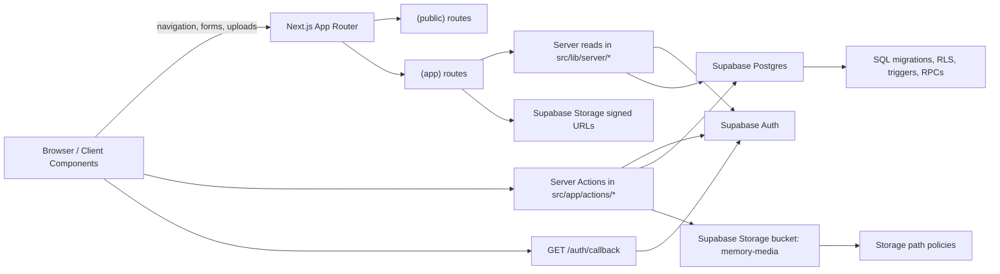

# System Architecture

This file describes the current system as implemented today. It is not a future-state design doc.

## Diagram

## Major Boundaries
- Browser/client components are untrusted. They can submit forms and render UI only.
- Next.js server code is the app orchestration layer. It performs reads, calls Server Actions, and initiates RPCs.
- Supabase Postgres is the authority for schema, RLS, triggers, and RPC-owned invariants.
- Supabase Storage is private and authorized through the couple ID embedded in object paths.

## Auth And Session Flow
- Middleware refreshes Supabase auth state on requests.
- Public routes handle login and invite acceptance.
- `GET /auth/callback` finishes Supabase callback exchange and normalizes the `next` redirect.
- Authenticated routes use `getAuthGateState()` / `getReadyCoupleContextOrRedirect()` before rendering protected content.
- The auth gate decides between:
- unauthenticated
- authenticated but needs invite
- authenticated and ready

## Data Read Flow
- Implemented authenticated pages are Server Components.
- Pages call server read helpers in `src/lib/server/*`.
- Read helpers query couple-scoped data through typed Supabase clients.
- Image-backed memories fetch signed storage URLs server-side before rendering.

## Mutation Flow
- Client forms use `react-hook-form` and submit to Server Actions.
- Server Actions validate inputs, require auth/couple context where needed, and then:
- write directly to couple-scoped tables when that is allowed by RLS, or
- call SQL RPCs when the mutation owns membership/invite invariants
- Mutations revalidate affected routes after successful writes.

## Trust Boundaries And Enforcement
- Couple bootstrap and invite acceptance are DB-owned invariants through RPCs.
- Membership visibility is controlled through `is_couple_member(...)`.
- Storage visibility and writes are controlled through storage policies keyed off the couple ID in the object path.
- The app layer must not substitute UI checks for SQL ownership rules.

## Current External Services
- Supabase Auth
- Supabase Postgres
- Supabase Storage

There is no live OpenAI integration and no live Mapbox integration in the current runtime.

## Scalability Assumptions
- The current product enforces one global couple space, not general multi-tenant scale-out behavior.
- The current runtime is optimized for correctness and a small private footprint, not for many concurrent couples.
- Any move away from the singleton-couple model is a schema and product change, not a styling or routing change.
