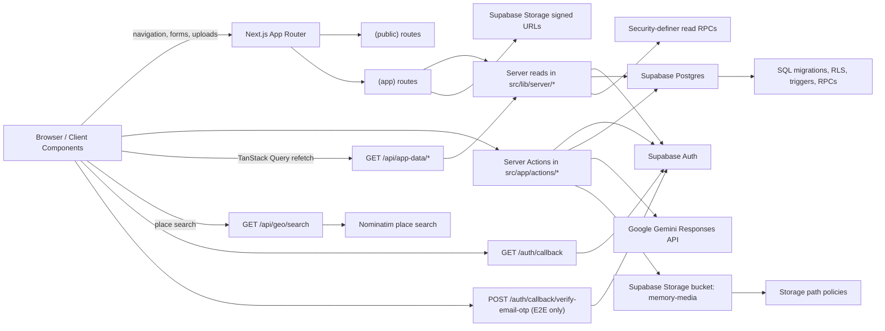

# System Architecture

This file describes the current system as implemented today. It is not a future-state design doc.

## Diagram

## Major Boundaries

- Browser/client components are untrusted. They can submit forms and render UI only.
- Next.js server code is the app orchestration layer. It performs reads, calls Server Actions, and initiates RPCs.
- Supabase Postgres is the authority for schema, RLS, triggers, and RPC-owned invariants.
- Supabase Storage is private and authorized through the couple ID embedded in object paths.

## Auth And Session Flow

- Middleware refreshes Supabase auth state on requests.
- Public routes handle login, first-user onboarding, and invite acceptance.
- `GET /auth/callback` finishes Supabase callback exchange and normalizes the `next` redirect.
- `POST /auth/callback/verify-email-otp` is an internal local-E2E helper and is enabled only through `E2E_ENABLE_EMAIL_OTP_HELPER` on loopback-host requests.
- Authenticated routes use `getAuthGateState()` / `getReadyCoupleContextOrRedirect()` before rendering protected content.
- The auth gate decides between:
- unauthenticated
- authenticated but needs onboarding
- authenticated but needs invite
- authenticated and ready
- Existing-couple detection uses the security-definer `has_any_couple()` RPC on the authenticated request path; it no longer uses a service-role admin client.

## Data Read Flow

- Implemented authenticated pages are Server Components.
- Pages call server read helpers in `src/lib/server/*`.
- Client refetches after TanStack Query invalidation go through the internal `/api/app-data/*` route handlers, which call the same server read helpers; place search goes through the `/api/geo/search` proxy.
- Read helpers query couple-scoped data through typed Supabase clients.
- Gameplay reads that depend on hidden answer state use security-definer SQL RPCs instead of direct `game_round_answers` table reads.
- Gameplay stats compute the couple-local meaning of `today` inside SQL before deriving streak and recent-history output.
- Image-backed memories fetch signed storage URLs server-side before rendering.

## Mutation Flow

- Client forms use `react-hook-form` and submit to Server Actions.
- Server Actions validate inputs, require auth/couple context where needed, and then:
- write directly to couple-scoped tables when that is allowed by RLS, or
- call SQL RPCs when the mutation owns membership/invite invariants or needs atomic multi-row writes
  (for example, memory row plus media through `update_memory_media`)
- `/games/daily-question` prompt generation calls the Google Gemini API from the server and persists through SQL RPCs only.
- Mutations revalidate affected routes after successful writes.

## Trust Boundaries And Enforcement

- Couple bootstrap and invite acceptance are DB-owned invariants through RPCs.
- The auth gate is read-only and does not bootstrap data implicitly.
- Membership visibility is controlled through `is_couple_member(...)`.
- Storage visibility and writes are controlled through storage policies keyed off the couple ID in the object path.
- The `reminder-processor` Edge Function requires a shared invoke secret, so only `pg_cron` (and authorized callers) can trigger reminder delivery.
- The `media-sweeper` Edge Function (hourly `memory-media-sweeper` pg_cron job) deletes orphaned `memory-media` bucket objects through the Storage API. It reuses the same shared invoke secret, selects candidates via the service-role-only `list_orphaned_memory_media(interval, int)` RPC (no `memory_media` row, older than a 24h cutoff), is bounded per run, and ships dry-run by default.
- The app layer must not substitute UI checks for SQL ownership rules.

## Current External Services

- Supabase Auth
- Supabase Postgres
- Supabase Storage
- Google Gemini API for daily-question prompt generation
- OpenFreeMap and MapLibre GL JS for map display
- Nominatim through the server-side `/api/geo/search` proxy for place search. The proxy's result cache and per-user / upstream rate limits are per-process (in-memory), so on a multi-instance deploy throttling is best-effort per instance rather than a single global budget; this is acceptable at the current scale and would need a distributed limiter to enforce globally.
- Gmail SMTP (via denomailer) for reminder email delivery from the `reminder-processor` Edge Function (invoked by `pg_cron` with a shared secret)

There is no live Mapbox integration in the current runtime.

## Scalability Assumptions

- The current product enforces one global couple space, not general multi-tenant scale-out behavior.
- The current runtime is optimized for correctness and a small private footprint, not for many concurrent couples.
- Any move away from the singleton-couple model is a schema and product change, not a styling or routing change.
